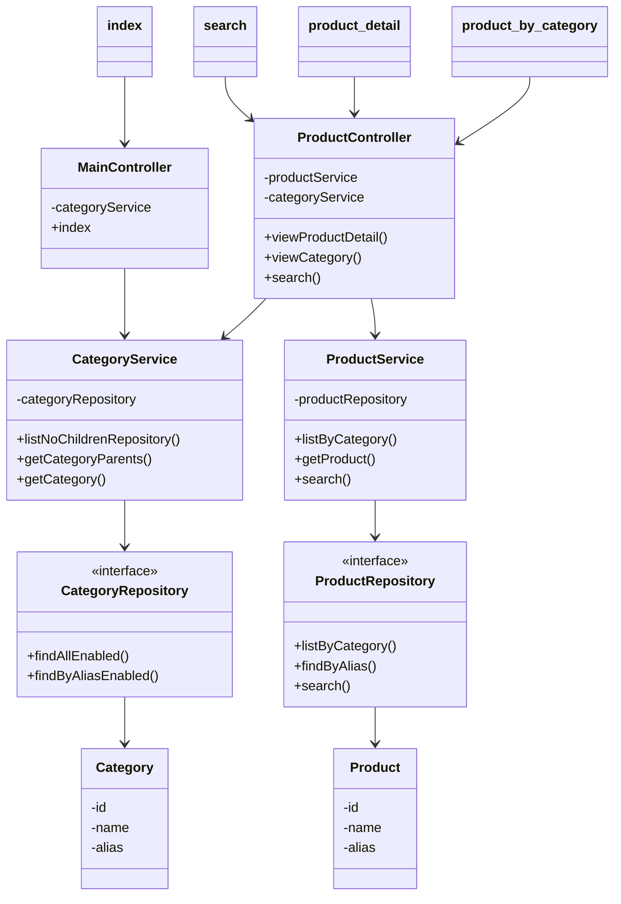

## Product Section

- On the user side, users interact with the application, in which they could view, and register for an account and buy the products.

### Overview

- The interface is designed for flexibility in end-users experiences with Revel sites. Visitors and customers can search for products in different ways, including searching by categories, titles, and products descriptions. Finally, each product would have their own page, which includes all of their information.

  

- In the homepage, there are categories of products, a left-side bar for navigation, top-right corner buttons for notifications and user registration, and at the bottom the website additional information. Those are universally configured for this side of the app.

- The foundational template is loaded by the MainController, while the components templates such as the sidebar, search box, header, footer, and page errors are organized using thymeleaf fragments.

#### Product Listing

- Products and categories are filtered in order to only display the proper ones using custom query in the repository layer.

- When searching through the categories, products are divided into sub-categories. They and their categories hierarchy are represented properly by specifying their parents and chilren alias and ids.

  

- Using thymeleaf, the hierarchy is demonstrated by the breadcrumb below the header from the current category way up to the root category. Each node is also a category, which displays its sub-categories and their products.

  

- Pagination at the bottom of the page used through out the app also uses the number of products, pre-defined size to organized products in pages using `PagingAndSortingRepository` and loaded by thymeleaf fragments. The proper connections between local modules and dicrectory paths are configured using `WebMvcConfigurer`.

- For each products, their information are displayed in individual pages, also loaded by their alias first, then displayed using thymeleaf.

  

- The searching function uses the same methodology - has it searched using custom query and finally loaded to show the search results

  

- Overview class diagram for the Product Listing (only the means of representing methods and their connections, but not relationships)

