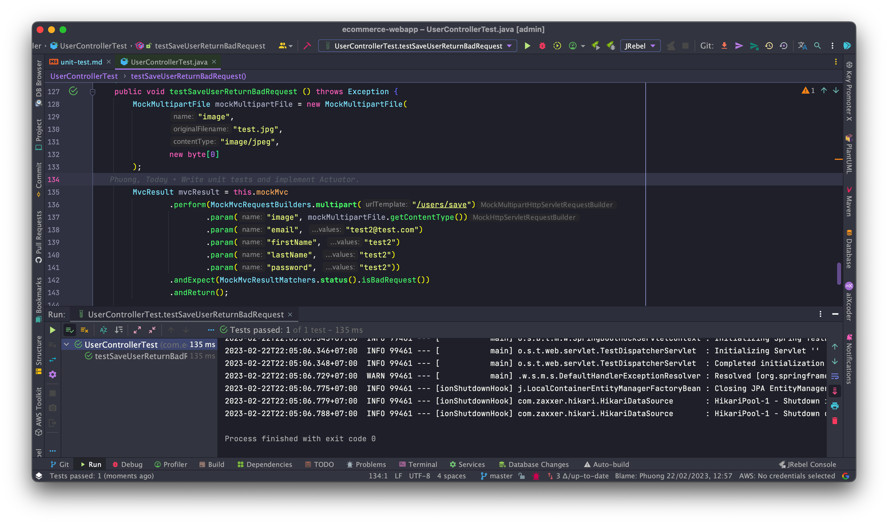
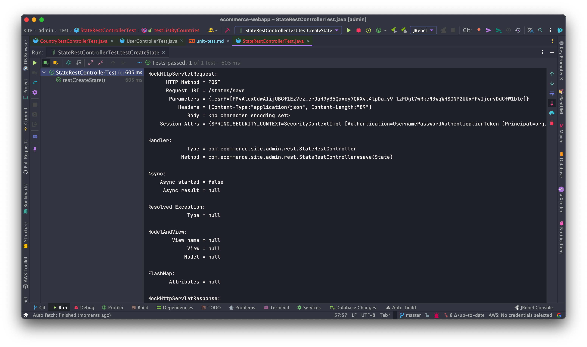
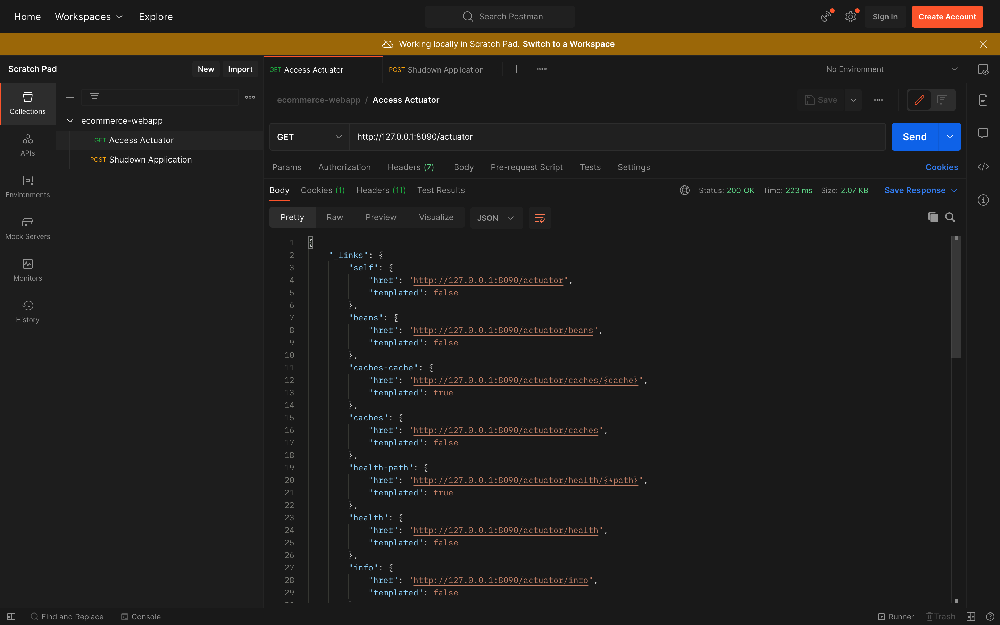
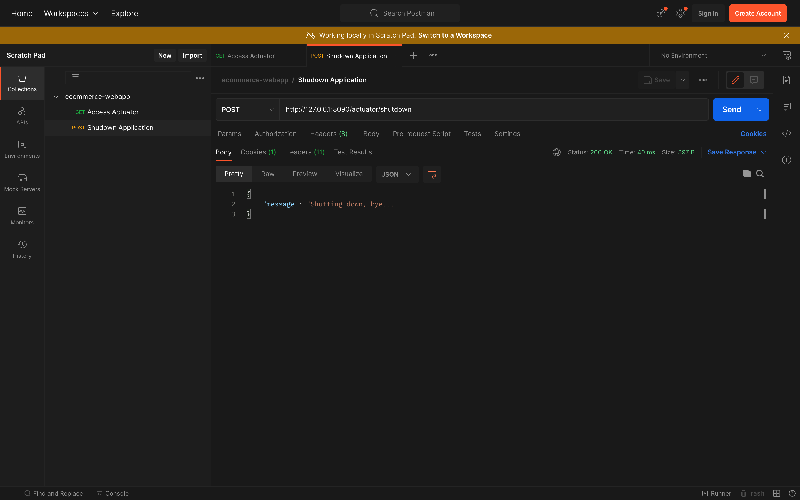

# Overview of Unit Testing with JUnit and Mockito
## Unit Testing for site admin
### Add dependencies
```xml
<dependency>
    <groupId>org.springframework.boot</groupId>
    <artifactId>spring-boot-starter-actuator</artifactId>
</dependency>
<dependency>
    <groupId>org.springframework.boot</groupId>
    <artifactId>spring-boot-starter-test</artifactId>
    <scope>test</scope>
    <exclusions>
        <exclusion>
            <groupId>junit</groupId>
            <artifactId>junit</artifactId>
        </exclusion>
    </exclusions>
</dependency>
<dependency>
    <groupId>org.junit.jupiter</groupId>
    <artifactId>junit-jupiter-api</artifactId>
    <version>5.9.2</version>
    <scope>test</scope>
</dependency>
<dependency>
    <groupId>org.junit.jupiter</groupId>
    <artifactId>junit-jupiter-engine</artifactId>
    <version>5.9.2</version>
    <scope>test</scope>
</dependency>
```

### Source Test Structure
```
├── <b>src</b>
│   ├── <b>test</b>
│   │   ├── <b>java</b>
│   │   │   ├── <b>com.ecommerce.site.admin</b>
│   │   │   │   ├── controller
│   │   │   │   ├── repository
│   │   │   │   ├── rest
│   │   │   │   ├── service
```

### Overview Unit Testing
<a href="src/test/java/com/ecommerce/site/admin">Click here</a> to view all layer

For code detail of specific test classes in each layer:
* <a href="src/test/java/com/ecommerce/site/admin/controller">Controller</a>
* <a href="src/test/java/com/ecommerce/site/admin/repository">Repository</a>
* <a href="src/test/java/com/ecommerce/site/admin/rest">Rest Controller</a>
* <a href="src/test/java/com/ecommerce/site/admin/service">Service</a>


#### 1. Test In Repository Layer
* `testSearchUser` case in `UserRepositoryTest` 
(<a href="src/test/java/com/ecommerce/site/admin/repository/UserRepositoryTest.java">Click here</a> to view code)


#### 2. Test In Service Layer
##### a) Using `@SpringBootTest` and `@TestPropertySource` to test in TEST database connection from `application-test.properties`
```java
@TestPropertySource(locations = "/application-test.properties")
@SpringBootTest
```

###### This demo below from `UserServiceTest` (<a href="src/test/java/com/ecommerce/site/admin/service/UserServiceTest.java">Click here</a> for detail)
Before each and after each unit testing, `JdbcTemplate` will execute sql script to get data for testing 
and delete all after finish each unit test.
```java
@Autowired
private JdbcTemplate jdbc;

@Value("${sql.script.insert.user}")
private String sqlInsertUser;

@Value("${sql.script.delete.user}")
private String sqlDeleteUser;

@Value("${sql.script.delete.user-role}")
private String sqlDeleteUserRole;

@Value("${sql.script.delete.role}")
private String sqlDeleteRole;

@BeforeEach
public void setupDatabase() {
    jdbc.execute(sqlInsertUser);
}

@AfterEach
public void setupAfterTransaction() {
    jdbc.execute(sqlDeleteUserRole);
    jdbc.execute(sqlDeleteUser);
    jdbc.execute(sqlDeleteRole);
}
```

* `testDeleteUser` case and its result
```java
@Test
@Rollback
public void testDeleteUser() throws UserNotFoundException {
    Optional<User> user = userRepository.findById(1);
    Assertions.assertTrue(user.isPresent(), "return true");

    userService.deleteById(1);

    user = userRepository.findById(1);
    Assertions.assertFalse(user.isPresent(), "return false");
}
```


##### Using `Mockito` with annotation `@ExtendWith(MockitoExtension.class)` and `@ExtendWith(SpringExtension.class)` to test in DEFAULT database connection from `application.properties`
###### This demo below from `CategoryServiceTest` (<a href="src/test/java/com/ecommerce/site/admin/service/CategoryServiceTest.java">Click here</a> to view code)

* Using `@MockBean` and `@InjectsMock`:
```java
@MockBean
private CategoryRepository repository;

@InjectMocks
private CategoryService service;
```

* `testCheckUniqueInNewModeReturnDuplicateName` case and its result
```java
@Test
public void testCheckUniqueInNewModeReturnDuplicateName() {
    String name = "Computers";
    String alias = "abc";
    
    Category category = new Category(null, name, alias);
    
    Mockito.when(repository.findByName(name)).thenReturn(category);
    Mockito.when(repository.findByAlias(alias)).thenReturn(null);
    
    String result = service.checkUnique(null, name, alias);
    
    assertThat(result).isEqualTo("DuplicateName");
}
```


#### 3. Test In Controller Layer
##### For unit testing in `@Controller` & `@RestController` layer, set ignore filter through annotation
```java
@AutoConfigureMockMvc(addFilters = false)
```

###### This demo below from `UserControllerTest` (<a href="src/test/java/com/ecommerce/site/admin/controller/UserControllerTest.java">Click here</a> to view code)
* `testSaveUserReturnBadRequest` case and its result
```java
@Test
public void testSaveUserReturnBadRequest () throws Exception {
    MockMultipartFile mockMultipartFile = new MockMultipartFile(
            "image",
            "test.jpg",
            "image/jpeg",
            new byte[0]
    );

    MvcResult mvcResult = this.mockMvc
            .perform(MockMvcRequestBuilders.multipart("/users/save")
                    .param("image", mockMultipartFile.getContentType())
                    .param("email", "test2@test.com")
                    .param("firstName", "test2")
                    .param("lastName", "test2")
                    .param("password", "test2"))
            .andExpect(MockMvcResultMatchers.status().isBadRequest())
            .andReturn();

    ModelAndView modelAndView = mvcResult.getModelAndView();

    if (modelAndView != null) {
        ModelAndViewAssert.assertViewName(modelAndView, "users");
    }
}
```



###### This demo below from `StateRestControllerTest` (<a href="src/test/java/com/ecommerce/site/admin/controller/UserControllerTest.java">Click here</a> to view code)
* `testCreateState` case and its result
```java
@Test
@WithMockUser(username = "something", password = "something", roles = "Admin")
public void testCreateState() throws Exception {
    String url = "/states/save";
    Integer countryId = 2;
    Country country = countryRepository.findById(countryId).get();
    State state = new State("Arizona", country);
    
    MvcResult result = mockMvc.perform(post(url).contentType("application/json")
            .content(objectMapper.writeValueAsString(state))
            .with(csrf()))
        .andDo(print())
        .andExpect(status().isOk())
        .andReturn();
    
    String response = result.getResponse().getContentAsString();
    Integer stateId = Integer.parseInt(response);
    Optional<State> findById = stateRepository.findById(stateId);
    
    assertThat(findById.isPresent());		
}
```



#### Other Unit Testing
###### `testEncodePassword` case and its result
```java
@Test
public void testEncodePassword() {
    BCryptPasswordEncoder passwordEncoder = new BCryptPasswordEncoder();

    String password = "test";
    String encodedPassword = passwordEncoder.encode(password);

    System.out.println(encodedPassword);

    boolean matches = passwordEncoder.matches(password, encodedPassword);

    assertThat(matches).isTrue();
}
```


# Overview of Spring Boot Actuator
### Config properties in application
```properties
management.server.port=8090
management.endpoints.web.exposure.include=*
management.endpoint.shutdown.enabled=true
```

### Access Actuator using Postman


### Shutdown application through Actuator
