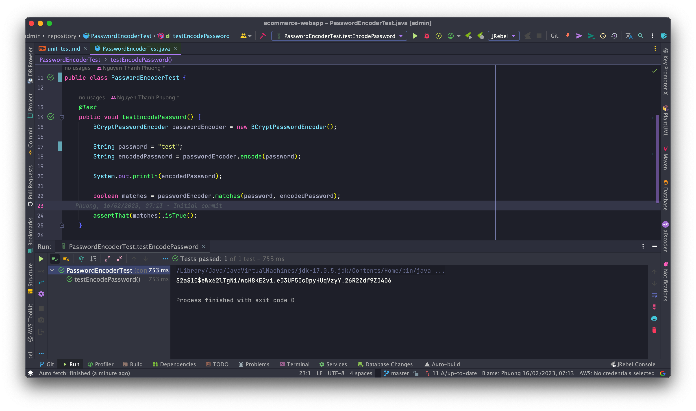
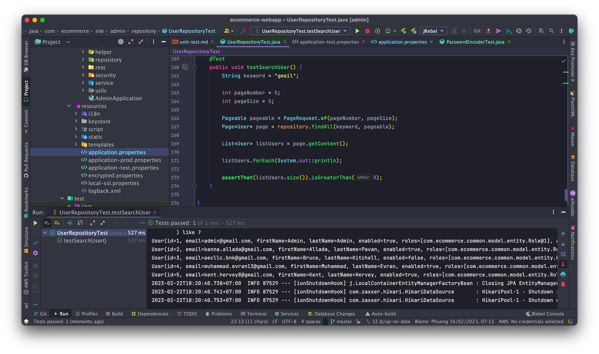
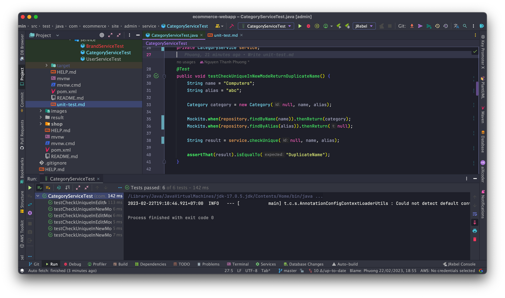

# Unit Test and Actuator
## Unit Test for site admin
### Add dependencies
```xml
<dependency>
    <groupId>org.springframework.boot</groupId>
    <artifactId>spring-boot-starter-actuator</artifactId>
</dependency>
<dependency>
    <groupId>org.springframework.boot</groupId>
    <artifactId>spring-boot-starter-test</artifactId>
    <scope>test</scope>
    <exclusions>
        <exclusion>
            <groupId>junit</groupId>
            <artifactId>junit</artifactId>
        </exclusion>
    </exclusions>
</dependency>
<dependency>
    <groupId>org.junit.jupiter</groupId>
    <artifactId>junit-jupiter-api</artifactId>
    <version>5.9.2</version>
    <scope>test</scope>
</dependency>
<dependency>
    <groupId>org.junit.jupiter</groupId>
    <artifactId>junit-jupiter-engine</artifactId>
    <version>5.9.2</version>
    <scope>test</scope>
</dependency>
```

### Source Test Structure
```
├── <b>src</b>
│   ├── <b>test</b>
│   │   ├── <b>java</b>
│   │   │   ├── <b>com.ecommerce.site.admin</b>
│   │   │   │   ├── controller
│   │   │   │   ├── repository
│   │   │   │   ├── service
```

### Result
#### Test `testEncodePassword`


#### Test In Repository Layer
* Test `testSearchUser` method in `UserRepositoryTest` 
(<a href="src/test/java/com/ecommerce/site/admin/repository/UserRepositoryTest.java">Click here</a> for detail)


#### Test In Service Layer
##### Using `@SpringBootTest` and `@TestPropertySource` to test in TEST database connection from `application-test.properties`
```java
@TestPropertySource(locations = "/application-test.properties")
@SpringBootTest
```
###### This demo result below from `UserServiceTest` (<a href="src/test/java/com/ecommerce/site/admin/service/UserServiceTest.java">Click here</a> for detail)
Before each and after each unit test, `JdbcTemplate` will execute sql script to get data for testing 
and delete all after finish each unit test.
```java
@Autowired
private JdbcTemplate jdbc;

@Value("${sql.script.insert.user}")
private String sqlInsertUser;

@Value("${sql.script.delete.user}")
private String sqlDeleteUser;

@Value("${sql.script.delete.user-role}")
private String sqlDeleteUserRole;

@Value("${sql.script.delete.role}")
private String sqlDeleteRole;

@BeforeEach
public void setupDatabase() {
    jdbc.execute(sqlInsertUser);
}

@AfterEach
public void setupAfterTransaction() {
    jdbc.execute(sqlDeleteUserRole);
    jdbc.execute(sqlDeleteUser);
    jdbc.execute(sqlDeleteRole);
}
```

* Test `testDeleteUser` and its result
```java
@Test
@Rollback
public void testDeleteUser() throws UserNotFoundException {
    Optional<User> user = userRepository.findById(1);
    Assertions.assertTrue(user.isPresent(), "return true");

    userService.deleteById(1);

    user = userRepository.findById(1);
    Assertions.assertFalse(user.isPresent(), "return false");
}
```


##### Using `Mockito` with annotation `@ExtendWith(MockitoExtension.class)` and `@ExtendWith(SpringExtension.class)` to test in VANILLA database connection
###### This demo result below from `CategoryServiceTest` (<a href="src/test/java/com/ecommerce/site/admin/service/CategoryServiceTest.java">Click here</a> for details)
* Using `@MockBean` and `@InjectsMock`:
```java
@MockBean
private CategoryRepository repository;

@InjectMocks
private CategoryService service;
```

* Test `testCheckUniqueInNewModeReturnDuplicateName` and its result
```java
@Test
public void testCheckUniqueInNewModeReturnDuplicateName() {
    String name = "Computers";
    String alias = "abc";
    
    Category category = new Category(null, name, alias);
    
    Mockito.when(repository.findByName(name)).thenReturn(category);
    Mockito.when(repository.findByAlias(alias)).thenReturn(null);
    
    String result = service.checkUnique(null, name, alias);
    
    assertThat(result).isEqualTo("DuplicateName");
}
```


#### Test In Controller Layer
##### Using `@SpringBootTest` and `@TestPropertySource` to test in TEST database connection from `application-test.properties`
```java
@TestPropertySource(locations = "/application-test.properties")
@SpringBootTest
```
###### This demo result below from `UserControllerTest` (<a href="src/test/java/com/ecommerce/site/admin/controller/UserControllerTest.java">Click here</a> for details)
* Test `testSaveUserReturnBadRequest` and it result
```java
@Test
public void testSaveUserReturnBadRequest () throws Exception {
    MockMultipartFile mockMultipartFile = new MockMultipartFile(
            "image",
            "test.jpg",
            "image/jpeg",
            new byte[0]
    );

    MvcResult mvcResult = this.mockMvc
            .perform(MockMvcRequestBuilders.multipart("/users/save")
                    .param("image", mockMultipartFile.getContentType())
                    .param("email", "test2@test.com")
                    .param("firstName", "test2")
                    .param("lastName", "test2")
                    .param("password", "test2"))
            .andExpect(MockMvcResultMatchers.status().isBadRequest())
            .andReturn();

    ModelAndView modelAndView = mvcResult.getModelAndView();

    if (modelAndView != null) {
        ModelAndViewAssert.assertViewName(modelAndView, "users");
    }
}
```
